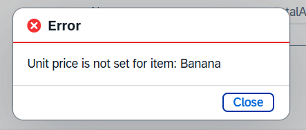
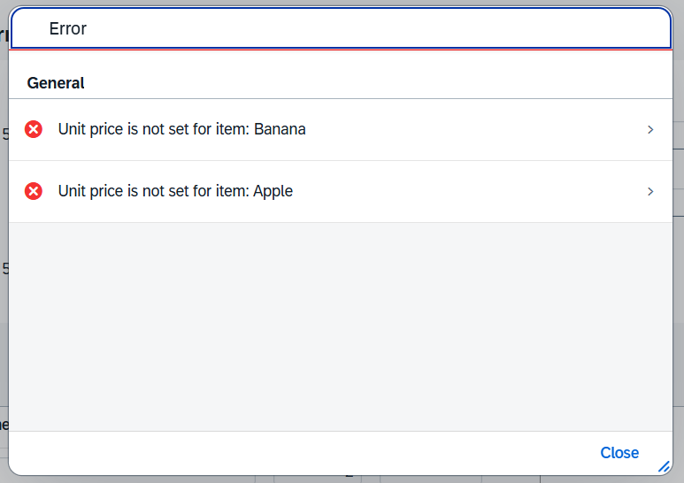
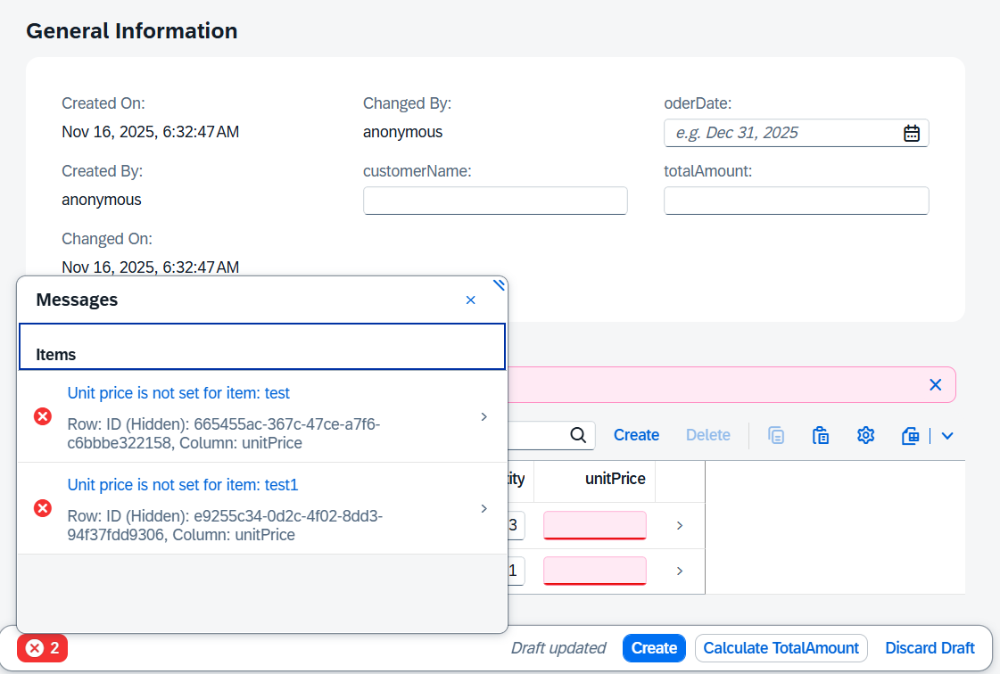

# Fiori Elements - Determining Actions Demo

## Purpose

This project demonstrates the behavior of Determining Actions in SAP Fiori Elements applications.

## Key Findings

- **Determining Actions visibility**: Actions are displayed in the footer not only in edit mode but also in display mode
- **Error handling**: When an action execution returns an error:
  - Single error: Displayed as a Message Box
  - Multiple errors: Displayed as a Message View
  - When highlighting a target field: Displayed as a Message Popover





## How to Run

### Start the CAP Java backend

```bash
cd cap-java
mvn spring-boot:run
```

### Start the Fiori application

```bash
cd ordersapp
npm start
```

### Access the application

Open your browser and navigate to: `http://localhost:8081/test/flp.html#app-preview`

## Key Implementation Points

### Show Action Only in Edit Mode

To display an action exclusively in edit mode, use the following annotation:

```xml
<Annotation Term="UI.Identification">
    <Collection>
        <Record Type="UI.DataFieldForAction">
            ...
            <Annotation Term="UI.Hidden" Path="IsActiveEntity"/>
        </Record>
    </Collection>
</Annotation>
```

### Side Effects Configuration

To refresh header fields after action execution, configure Side Effects as follows:

```xml
<Annotations Target="OrderService.calculateTotalAmount(OrderService.Orders)">
    <Annotation Term="Common.SideEffects">
        <Record Type="Common.SideEffectsType">
            <PropertyValue Property="TargetProperties">
                <Collection>
                    <String>in/totalAmount</String>
                </Collection>
            </PropertyValue>
        </Record>
    </Annotation>
</Annotations>
```
